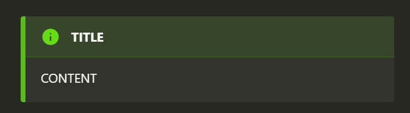
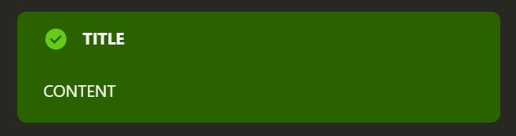
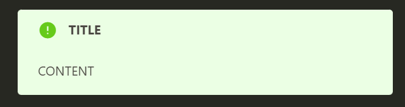

# markdown-it-info


The [markdown-it](https://l.pg1x.com/G6nd) plugin that enables easy creation of  [Qiita](https://qiita.com/) and [Zenn](https://zenn.dev/)-style admonition boxes within Markdown documents.

<!-- omit in toc -->
- [Setup](#setup)
- [Quick Usage](#quick-usage)
- [Usage](#usage)
- [Features](#features)
- [Extensions](#extensions)
- [Acknowledgments](#acknowledgments)

## Setup
Install via npm:

```bash
npm install markdown-it-info
```

Use with markdown-it:

```js
const 
    md = require('markdown-it')(),
    plugin = require("markdown-it-info");

md.use(plugin,{options});
```
Params:

- **options**:
  - **admonitionStyle** - Optional value to change the CSS style sheet. Default is “default”, others are “qiita” and “zen”.
  - **defaultType** - Optional value to change the default type of the box. Default is “info”, others are “warn”, “warning”, “alert” and “question”.
  - **defaultTitle** - Optional value to change the default title of the box. Default is “Enter the title here”.


## Quick Usage
Input in Markdown:
```md:
:::note info TITLE
CONTENT
:::
```


Rendering in HTML:
```html:
<div class="default-admonition info">
<p class="default-admonition-title">TITLE</p>
<p>CONTENT</p>
</div>
```

## Usage
This is a markdown-it plugin that allows you to easily create an “Admonition Box”.

Normally, the “default-admonition” class is assigned, but “qiita-admonition” and “zenn-admonition” can be assigned by changing the admonitionStyle.

This plugin alone only gives a class, but the included stylesheet will decorate the box.

admonitionStyle is "default":



admonitionStyle is "qiita":



admonitionStyle is "zenn":




## Features
markdown-it-info's key features include:

- Add admonition boxes with Syntax like [Qiita](https://qiita.com/) and [Zenn](https://zenn.dev/)
- Support multiple box types (e.g. info, warn, alert, question)
- Enable Markdown syntax within boxes (lists, emphasis, strikethrough, code spans, links, images, code blocks)
- Supports nesting of boxes within each other

These features enhance the readability and visual appeal of technical documents and blog posts.


## Extensions
- [yusu79/vscode-markdown-info](https://github.com/yusu79/vscode-markdown-info)

## Acknowledgments
In developing this project, we referenced the following open source software. We would like to express our gratitude:

- [qjebbs/vscode-markdown-extended](https://github.com/qjebbs/vscode-markdown-extended)
