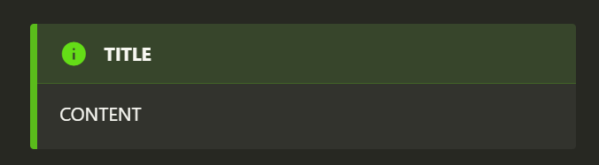
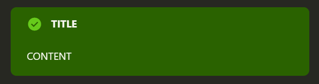
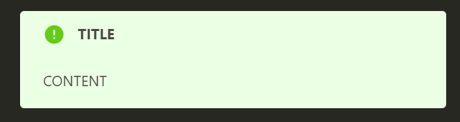

# markdown-it-info


[English](#markdown-it-info) | [日本語](#日本語)

A [markdown-it](https://github.com/markdown-it/markdown-it) plugin for configurable note boxes. Choose a visual preset, add HTML classes and attributes, and optionally embed the box's CSS in the generated HTML.

## Installation

```bash
npm install markdown-it markdown-it-info
```

```js
const md = require("markdown-it")();
const info = require("markdown-it-info");

md.use(info, { style: "bordered" });
```

`embedCss` is off by default. In that mode, load the matching reference stylesheet from the package's `reference-styles/` directory in the page or preview that displays the HTML. If you move the reference stylesheet, preserve or update the relative path to the font in the CSS.

## Example

```md
:::note info Setup
Follow these steps.
:::
```

This produces:

```html
<div class="bordered-admonition info">
<p class="bordered-admonition-title">Setup</p>
<p>Follow these steps.</p>
</div>
```

## Features

- `:::note` and `:::message` blocks with `info`, `warn`, `warning`, `alert`, and `question` types.
- Optional titles, Markdown content, and nested boxes.
- Three visual presets: `bordered`, `solid`, and `pastel`.
- Custom classes and HTML attributes from options, front matter, or block attributes; color overrides from options or front matter.
- Per-box CSS embedding for HTML that does not depend on the reference stylesheet.

## Usage

### Syntax and titles

Write `:::note TYPE TITLE` (or `:::message TYPE TITLE`) and close it with `:::`. Omit `TITLE` to omit the title; the first content paragraph occupies the title's position, including its icon when the corresponding styling is available. Set `defaultTitle` to a string if untitled blocks should instead receive that title. Its default is `null`.

```md
:::note info
No separate title is rendered here.
:::

:::note warn Check this
Review the configuration.
:::
```

### Classes and attributes

Put an attribute list at the end of the opening line. `.name` adds a class, `#name` sets the ID, and `name=value` sets an HTML attribute. Quote values containing spaces. The reserved `css=true` or `css=false` switches CSS embedding for that box; it is not emitted as an HTML attribute.

```md
:::note info {.is-style-icon_info .wp-block-paragraph #wordpress-info role=note data-source=markdown css=false}
This box carries the classes used by a WordPress/SWELL info box.
:::
```

The generated `<div>` has `is-style-icon_info wp-block-paragraph`, `id="wordpress-info"`, `role="note"`, and `data-source="markdown"` in addition to the plugin's own classes. Its appearance still depends on the CSS of the destination page. Use `{css=true}` if you want the plugin to put its own styling into the HTML instead.

### YAML front matter

This plugin cannot parse raw YAML text, but it can read information stored in `env.frontmatter.markdown.note`. To provide that information, another application must parse the YAML and pass it in `env.frontmatter` when calling `md.render(markdown, env)`. The plugin does not read settings under `markdown` other than `note`.

```yaml
---
markdown:
  note:
    classes:
      - shared-note
    embedCss: false
    info:
      classes:
        - is-style-icon_info
        - wp-block-paragraph
      attributes:
        role: note
        data-source: markdown
      defaultTitle: null
      style: bordered
      embedCss: true
  mojicolor:
    bold: color
  digit:
    locale: jp
---
```

The settings directly under `markdown.note` apply to all types. A type key such as `markdown.note.info` overrides shared values for that type. If both levels specify `classes`, the type-specific YAML classes replace the shared YAML classes. Classes from JavaScript options and the opening line are also added. HTML attributes merge by name, with the more specific value winning.

### CSS embedding

With `embedCss: false` (the default), the output contains classes for the selected reference stylesheet. With `embedCss: true` or `{css=true}`, the plugin adds inline `style` attributes and an icon element to the generated HTML. It does not add a `<style>` element. `{css=false}` turns embedding off for one box, even when it is enabled in options or YAML. CSS embedding is useful when copying rendered HTML to another editor, including Markdown Clip workflows.

## Explanation

| `style` | Appearance | Reference stylesheet |
| --- | --- | --- |
| `bordered` (default) | Border-accented box | `reference-styles/bordered-styles.css` |
| `solid` | Strong filled box | `reference-styles/solid-styles.css` |
| `pastel` | Soft filled box | `reference-styles/pastel-styles.css` |





For a given setting, the precedence is: built-in defaults → global JavaScript options → `types.TYPE` JavaScript options → shared YAML → type-specific YAML → opening-line attributes where supported. Opening-line attributes set classes, HTML attributes, and the `css` switch; they do not select a style or colors.

The companion [VS Code extension](https://github.com/yusu79/vscode-markdown-info) uses this plugin for Markdown previews.

## Settings

Pass an options object to `md.use(info, options)`. For example:

```js
md.use(info, {
  style: "solid",
  classes: ["custom-note"],
  attributes: { role: "note" },
  types: { warn: { style: "bordered" } }
});
```

`style`, `defaultTitle`, `classes`, `attributes`, `colors`, and `embedCss` can also be set under `markdown.note` or its type-specific YAML key. `defaultType` and `types` are JavaScript options only.

| Option | Default | Purpose |
| --- | --- | --- |
| `style` | `bordered` | Visual preset: `bordered`, `solid`, or `pastel`. |
| `defaultType` | `info` | Type when the opening line does not specify one. |
| `defaultTitle` | `null` | String title for blocks without an explicit title; `null` omits it. |
| `classes` | `[]` | Additional class name(s), as a string or array. |
| `attributes` | `{}` | HTML attributes on the outer `<div>`. |
| `colors` | `{}` | Color overrides: `border`, `background`, `titleBackground`, `titleBorder`, `icon`, `text`. |
| `embedCss` | `false` | Embed box styling as inline HTML styles. |
| `types` | `{}` | Per-type overrides keyed by `info`, `warn`, `warning`, `alert`, or `question`. |

`types.TYPE` supports `style`, `defaultTitle`, `classes`, `attributes`, `colors`, and `embedCss`. `admonitionStyle` is also accepted as a legacy alias for the global `style` option; prefer `style` in new configuration. An explicit `defaultTitle: false` is accepted for compatibility and means `null`.

## Acknowledgments

The original implementation drew on [qjebbs/vscode-markdown-extended](https://github.com/qjebbs/vscode-markdown-extended).

## 日本語

[English](#markdown-it-info) | [日本語](#日本語)

[markdown-it](https://github.com/markdown-it/markdown-it) 用のノートボックスプラグインです。デザイン、HTML の class・属性を指定でき、生成 HTML にボックス用 CSS を埋め込むこともできます。

## インストール

```bash
npm install markdown-it markdown-it-info
```

```js
const md = require("markdown-it")();
const info = require("markdown-it-info");

md.use(info, { style: "bordered" });
```

`embedCss` は初期状態ではオフです。この場合、HTML を表示するページやプレビューで、パッケージの `reference-styles/` 内の対応する参照CSSを読み込んでください。参照CSSを移動する場合は、CSS内のフォントへの相対パスも維持または修正してください。

## 使用例

```md
:::note info Setup
Follow these steps.
:::
```

生成される HTML は次のとおりです。

```html
<div class="bordered-admonition info">
<p class="bordered-admonition-title">Setup</p>
<p>Follow these steps.</p>
</div>
```

## 機能

- `:::note` と `:::message`、および `info`、`warn`、`warning`、`alert`、`question` に対応します。
- タイトル省略、ボックス内の Markdown、ボックスの入れ子に対応します。
- `bordered`、`solid`、`pastel` の3種類のデザインがあります。
- オプション、フロントマター、開始行から class と HTML 属性を設定できます。色はオプション・フロントマターで指定します。
- ボックス単位で CSS を埋め込めます。

## 使用方法

### 構文とタイトル

`:::note TYPE TITLE`（または `:::message TYPE TITLE`）で開始し、`:::` で閉じます。`TITLE` を省略するとタイトル要素は出力されず、最初の本文段落がタイトルの位置から始まります。対応するスタイルが利用できる場合、アイコンも残ります。タイトルを自動で補いたい場合は `defaultTitle` に文字列を指定します。初期値は `null` です。

```md
:::note info
ここではタイトルを別に出力しません。
:::

:::note warn 確認してください
設定を見直してください。
:::
```

### class と属性

開始行の末尾に属性リストを書きます。`.name` は class、`#name` は ID、`name=value` は HTML 属性です。空白を含む値は引用符で囲みます。予約された `css=true` と `css=false` は、そのボックスの CSS 埋め込みだけを切り替え、HTML 属性としては出力されません。

```md
:::note info {.is-style-icon_info .wp-block-paragraph #wordpress-info role=note data-source=markdown css=false}
WordPress / SWELL の info ボックスで使う class を付けます。
:::
```

生成される `<div>` にはプラグイン自身の class に加え、`is-style-icon_info wp-block-paragraph`、`id="wordpress-info"`、`role="note"`、`data-source="markdown"` が付きます。見た目は貼り付け先の CSS に依存します。プラグイン自身のスタイルを HTML に含めたい場合は `{css=true}` を使います。

### YAML フロントマター

このプラグインは生の YAML テキストの解析はできませんが、 `env.frontmatter.markdown.note` に格納された情報は読み取れます。情報を格納するためには他のアプリに YAML を解析させ、 `md.render(markdown, env)` の `env.frontmatter` に渡す必要があります。`markdown` 配下の`note:`以外の設定は読み込みません。

```yaml
---
markdown:
  note:
    classes:
      - shared-note
    embedCss: false
    info:
      classes:
        - is-style-icon_info
        - wp-block-paragraph
      attributes:
        role: note
        data-source: markdown
      defaultTitle: null
      style: bordered
      embedCss: true
  mojicolor:
    bold: color
  digit:
    locale: jp
---
```

`markdown.note` 直下の設定は全タイプ共通です。`markdown.note.info` などのタイプ別設定は、そのタイプの共通設定より優先されます。両方に `classes` がある場合、タイプ別 YAML の class が共通 YAML の class を置き換えます。JavaScript オプションと開始行の class はさらに追加されます。HTML 属性は名前ごとに統合し、より個別の設定が優先されます。

### CSS の埋め込み

初期値の `embedCss: false` では、選択した参照 CSS 用の class を出力します。`embedCss: true` または `{css=true}` では、生成 HTML にインライン `style` 属性とアイコン要素を追加します。`<style>` 要素は追加しません。オプションや YAML で埋め込みを有効にしていても、個々のボックスで `{css=false}` と書けば無効にできます。Markdown Clip などで変換した HTML を別のエディターにコピーする場合に使えます。

## 解説

| `style` | 見た目 | 参照 CSS |
| --- | --- | --- |
| `bordered`（初期値） | 枠線を強調 | `reference-styles/bordered-styles.css` |
| `solid` | 濃い塗りつぶし | `reference-styles/solid-styles.css` |
| `pastel` | 淡い塗りつぶし | `reference-styles/pastel-styles.css` |


設定の優先順位は、組み込み初期値 → JavaScript 共通オプション → JavaScript の `types.TYPE` → YAML 共通設定 → YAML タイプ別設定 → 対応する開始行の属性、です。開始行で指定できるのは class、HTML 属性、`css` の切り替えです。デザインや色は指定できません。

このプラグインを Markdown プレビューで使う [VS Code 拡張機能](https://github.com/yusu79/vscode-markdown-info) もあります。

## 設定オプション

`md.use(info, options)` にオプションオブジェクトを渡します。例：

```js
md.use(info, {
  style: "solid",
  classes: ["custom-note"],
  attributes: { role: "note" },
  types: { warn: { style: "bordered" } }
});
```

`style`、`defaultTitle`、`classes`、`attributes`、`colors`、`embedCss` は `markdown.note` または YAML のタイプ別キーにも書けます。`defaultType` と `types` は JavaScript オプション専用です。

| オプション | 初期値 | 内容 |
| --- | --- | --- |
| `style` | `bordered` | `bordered`、`solid`、`pastel` からデザインを選択。 |
| `defaultType` | `info` | 開始行でタイプを省略した場合のタイプ。 |
| `defaultTitle` | `null` | 明示したタイトルがない場合の文字列。`null` なら省略。 |
| `classes` | `[]` | 追加する class。文字列または配列。 |
| `attributes` | `{}` | 外側の `<div>` に付ける HTML 属性。 |
| `colors` | `{}` | `border`、`background`、`titleBackground`、`titleBorder`、`icon`、`text` の色。 |
| `embedCss` | `false` | ボックスのスタイルをインラインで HTML に埋め込む。 |
| `types` | `{}` | `info`、`warn`、`warning`、`alert`、`question` 別の設定。 |

`types.TYPE` には `style`、`defaultTitle`、`classes`、`attributes`、`colors`、`embedCss` を指定できます。旧 `admonitionStyle` も共通 `style` の互換用エイリアスとして使用可能ですが、新規設定では `style` を使ってください。互換用の `defaultTitle: false` は `null` として扱います。

## 謝辞

初期実装では [qjebbs/vscode-markdown-extended](https://github.com/qjebbs/vscode-markdown-extended) を参考にしました。
